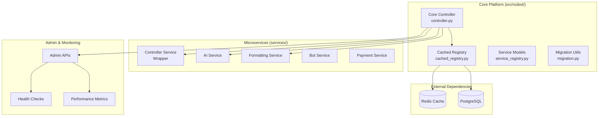
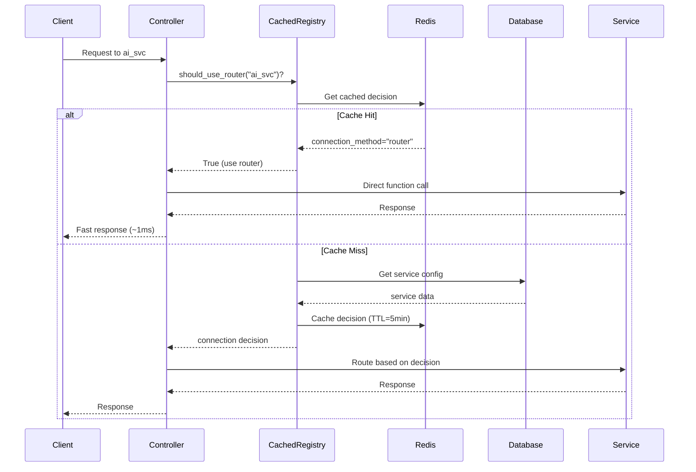

# 🏗️ RssBot Platform Architecture

## 🎯 Overview

The RssBot Platform represents a **revolutionary approach to microservices architecture**, featuring the world's first **per-service hybrid connection method system** with **Redis-cached service discovery**. This document provides a comprehensive overview of the platform's design, components, and architectural decisions.

## 🚀 Architectural Philosophy

### Core Principles

1. **🔧 Per-Service Autonomy**: Each service independently decides its connection method
2. **⚡ Performance-First**: Redis caching for sub-millisecond service decisions
3. **🏥 Self-Healing**: Automatic health monitoring and intelligent routing
4. **🔒 Type Safety**: 100% type-safe codebase with comprehensive validation
5. **🔄 Zero-Downtime**: Live configuration changes without service restarts

### Revolutionary Features

- **Hybrid Connection Methods**: Services choose `router`/`rest`/`hybrid`/`disabled` independently
- **Redis-Cached Registry**: First-of-its-kind cached service discovery system
- **Intelligent Fallbacks**: Automatic degradation from router to REST when needed
- **Live Reconfiguration**: Change service behavior without downtime

## 🏗️ System Architecture

### 📊 High-Level Overview



### 🔄 Connection Method Flow



## 🎯 Core Components

### 1. **Core Platform (`src/rssbot/core/`)**

#### `controller.py` - Platform Orchestration Engine
```python
class ControllerCore:
    """
    Heart of the hybrid microservices platform.
    
    Responsibilities:
    - Service discovery and registration
    - Dynamic router mounting based on per-service decisions
    - Health monitoring and cache management
    - Admin operations and migrations
    """
    
    async def initialize(self) -> FastAPI:
        """Initialize platform with Redis-backed registry."""
        
    async def _discover_and_mount_services(self) -> None:
        """Mount services based on their connection method decisions."""
        
    async def _mount_service(self, service_name: str, router_path: str) -> None:
        """Mount individual service as FastAPI router."""
```

**Key Features:**
- Type-safe service mounting with comprehensive error handling
- Automatic health monitoring with Redis cache updates
- Zero-downtime service configuration changes
- Enterprise-grade logging and metrics

#### `config.py` - Configuration Management
```python
class Config(BaseSettings):
    """Type-safe platform configuration with validation."""
    
    # Database settings
    database_url: str
    db_echo: bool = False
    
    # Redis settings (required for performance)
    redis_url: str = "redis://localhost:6379/0"
    
    # Service communication
    service_token: str
    controller_service_port: int = 8004
    
    # Legacy support (deprecated)
    local_router_mode: Optional[bool] = None
```

### 2. **Service Discovery (`src/rssbot/discovery/`)**

#### `cached_registry.py` - Redis-Backed Service Registry
```python
class CachedServiceRegistry:
    """
    High-performance service registry with Redis caching.
    
    Architecture:
    - Redis as primary cache (sub-millisecond lookups)
    - Database as persistent source of truth
    - Per-service connection method decisions
    - Automatic fallback and self-healing
    """
    
    CACHE_PREFIX = "rssbot:service:"
    CACHE_TTL = 300  # 5 minutes
    HEALTH_CACHE_TTL = 60  # 1 minute
    
    async def should_use_router(self, service_name: str) -> bool:
        """PRIMARY METHOD: Decide if service should use router mode."""
        
    async def get_effective_connection_method(self, service_name: str) -> ConnectionMethod:
        """Get effective connection method with health considerations."""
        
    async def invalidate_service_cache(self, service_name: str) -> None:
        """Invalidate cached data for specific service."""
```

**Performance Benefits:**
- **Sub-millisecond lookups** via Redis cache
- **Automatic fallback** to database when Redis unavailable
- **Health-based decisions** with real-time cache updates
- **Intelligent TTL management** for optimal performance

#### `proxy.py` - Intelligent Service Proxy
```python
class ServiceProxy:
    """
    Smart proxy for automatic service routing based on cached decisions.
    
    Features:
    - Automatic router vs REST routing
    - Health-based fallback mechanisms
    - Real-time cache updates
    - Type-safe method calls
    """
    
    async def _execute_service_call(self, method_name: str, *args, **kwargs) -> Any:
        """Execute service call using optimal connection method."""
```

**Usage Example:**
```python
# Automatic routing based on cached service decisions
ai = ServiceProxy("ai_svc")
result = await ai.summarize(text="Hello world")
# Routes to router OR REST based on service configuration
```

### 3. **Data Models (`src/rssbot/models/`)**

#### `service_registry.py` - Type-Safe Service Models
```python
class ConnectionMethod(str, enum.Enum):
    """Per-service connection method options."""
    ROUTER = "router"      # In-process FastAPI router (fastest)
    REST = "rest"          # HTTP calls with JSON (scalable)
    HYBRID = "hybrid"      # Router preferred, auto-fallback to REST
    DISABLED = "disabled"  # Service completely disabled

class RegisteredService(BaseEntity, table=True):
    """Type-safe service registration model."""
    
    name: str = Field(index=True, unique=True)
    display_name: str
    connection_method: ConnectionMethod = Field(default=ConnectionMethod.REST)
    health_status: str = Field(default="unknown")
    has_router: bool = Field(default=False)
    is_active: bool = Field(default=True)
    
    def get_effective_connection_method(self) -> ConnectionMethod:
        """Get effective method considering health and availability."""
        if not self.is_active:
            return ConnectionMethod.DISABLED
            
        if self.connection_method == ConnectionMethod.DISABLED:
            return ConnectionMethod.DISABLED
            
        if self.connection_method == ConnectionMethod.ROUTER:
            return ConnectionMethod.ROUTER if self.has_router else ConnectionMethod.REST
            
        return self.connection_method
```

### 4. **Migration Utilities (`src/rssbot/utils/`)**

#### `migration.py` - Legacy System Migration
```python
async def should_use_router_for_service(service_name: str) -> bool:
    """
    GLOBAL REPLACEMENT FUNCTION for LOCAL_ROUTER_MODE checks.
    
    Use throughout codebase instead of:
    - os.getenv("LOCAL_ROUTER_MODE", "false").lower() == "true"
    - config.local_router_mode
    """
    
async def migrate_from_global_router_mode() -> Dict[str, str]:
    """Migrate from global LOCAL_ROUTER_MODE to per-service decisions."""
```

## 🔧 Service Architecture

### Service Types by Connection Method

#### 🚀 Router Services (High Performance)
```python
# Characteristics:
# - In-process function calls
# - Shared memory and resources  
# - Sub-5ms response times
# - Best for: AI processing, formatting, user management

# Example services configured for router mode:
services_router = {
    "ai_svc": "router",         # AI processing needs speed
    "formatting_svc": "router", # Content formatting
    "user_svc": "router",       # User data queries
}
```

#### 🌐 REST Services (Scalable)
```python
# Characteristics:
# - HTTP-based communication
# - Independent processes
# - Horizontal scaling capability
# - Best for: Bot communication, payments, external integrations

# Example services configured for REST mode:
services_rest = {
    "bot_svc": "rest",        # Telegram bot isolation
    "payment_svc": "rest",    # Payment security
    "channel_mgr_svc": "rest" # RSS feed processing
}
```

#### 🔄 Hybrid Services (Intelligent)
```python
# Characteristics:
# - Router preferred, REST fallback
# - Automatic health-based switching
# - Best reliability and performance
# - Best for: Critical services that need both speed and reliability

# Example hybrid configuration:
services_hybrid = {
    "db_svc": "hybrid",       # Database access
    "admin_svc": "hybrid"     # Admin operations
}
```

### 📊 Performance Characteristics

| Connection Method | Latency | Throughput | Isolation | Scaling | Use Case |
|------------------|---------|------------|-----------|---------|----------|
| **Router** | <1ms | Very High | Low | Vertical | High-frequency operations |
| **REST** | 10-50ms | High | High | Horizontal | Independent services |
| **Hybrid** | 1-50ms | Variable | Medium | Both | Critical services |
| **Disabled** | N/A | N/A | Complete | N/A | Maintenance mode |

## 🗄️ Data Flow Architecture

### 1. **Service Request Flow**

```python
# 1. Client Request
client_request = {
    "endpoint": "/ai/summarize",
    "data": {"text": "content to summarize"},
    "headers": {"X-Service-Token": "..."}
}

# 2. Controller Processing  
controller.route_request(request)

# 3. Cache Lookup (Redis)
cached_method = redis.get("rssbot:service:ai_svc:method")  # <1ms

# 4. Service Execution
if cached_method == "router":
    result = ai_service.summarize(text)  # Direct function call
else:
    result = await http_client.post("http://ai_svc:8005/summarize", ...)

# 5. Response
return result
```

### 2. **Health Monitoring Flow**

```python
# Continuous health monitoring cycle
async def health_monitor_loop():
    while True:
        for service in registered_services:
            # Check service health
            health = await check_service_health(service)
            
            # Update cache immediately
            await redis.setex(
                f"rssbot:service:{service.name}:health",
                60,  # 1 minute TTL
                health.status
            )
            
            # Update database for persistence
            await db.update_service_health(service.name, health)
            
        await asyncio.sleep(60)  # Check every minute
```

### 3. **Configuration Change Flow**

```python
# Zero-downtime configuration changes
async def update_service_connection_method(service_name: str, method: ConnectionMethod):
    # 1. Update database (source of truth)
    await db.update_service_method(service_name, method)
    
    # 2. Invalidate cache (forces fresh lookup)
    await redis.delete(f"rssbot:service:{service_name}:method")
    
    # 3. Next request will use new method automatically
    # No restart required!
```

## 🔒 Security Architecture

### 🛡️ Authentication & Authorization

```python
class SecurityManager:
    """Enterprise-grade security for inter-service communication."""
    
    async def verify_service_token(self, token: str) -> bool:
        """Verify service-to-service authentication token."""
        
    async def validate_service_request(self, request: Request) -> bool:
        """Validate service request with rate limiting."""
        
    async def audit_service_access(self, service: str, action: str) -> None:
        """Audit service access for security monitoring."""
```

**Security Features:**
- **Service Token Authentication**: Secure inter-service communication
- **Request Validation**: Input sanitization and validation
- **Rate Limiting**: Protection against abuse
- **Audit Logging**: Complete security audit trail

### 🔐 Data Protection

- **Type Safety**: 100% type hints prevent injection attacks
- **Input Validation**: Pydantic models validate all inputs
- **Secure Defaults**: Fail-safe configuration options
- **Encrypted Communication**: HTTPS for REST services

## 📈 Scalability Architecture

### 🔄 Horizontal Scaling

```yaml
# Kubernetes deployment example
apiVersion: apps/v1
kind: Deployment
metadata:
  name: rssbot-platform
spec:
  replicas: 3
  selector:
    matchLabels:
      app: rssbot-platform
  template:
    spec:
      containers:
      - name: platform
        image: rssbot-platform:latest
        env:
        - name: REDIS_URL
          value: "redis://redis-cluster:6379"
        - name: DATABASE_URL
          value: "postgresql://..."
        resources:
          requests:
            memory: "512Mi"
            cpu: "250m"
          limits:
            memory: "1Gi" 
            cpu: "500m"
```

### 📊 Performance Optimization

#### Cache Strategy
```python
# Multi-level caching for optimal performance
class CacheStrategy:
    # L1: Application memory (fastest)
    local_cache: Dict[str, Any] = {}
    
    # L2: Redis cluster (fast, shared)
    redis_cache: redis.Redis
    
    # L3: Database (persistent, fallback)
    database: AsyncSession
    
    async def get_service_decision(self, service_name: str) -> ConnectionMethod:
        # Try L1 cache first
        if service_name in self.local_cache:
            return self.local_cache[service_name]
            
        # Try L2 cache (Redis)
        cached = await self.redis_cache.get(f"service:{service_name}")
        if cached:
            self.local_cache[service_name] = cached  # Populate L1
            return cached
            
        # Fallback to L3 (Database)
        result = await self.database.get_service_config(service_name)
        
        # Populate all cache levels
        await self.redis_cache.setex(f"service:{service_name}", 300, result)
        self.local_cache[service_name] = result
        
        return result
```

## 🔄 Deployment Architecture

### 🐳 Container Strategy

```dockerfile
# Multi-stage build for optimal image size
FROM python:3.11-slim as builder
WORKDIR /app
COPY requirements.txt .
RUN pip install --no-cache-dir -r requirements.txt

FROM python:3.11-slim
WORKDIR /app
COPY --from=builder /usr/local/lib/python3.11/site-packages /usr/local/lib/python3.11/site-packages
COPY src/ ./src/
COPY services/ ./services/

# Use core platform entry point
CMD ["python", "-m", "rssbot"]
```

### ⚖️ Load Balancing

```yaml
# HAProxy configuration for service load balancing
backend rssbot_platform
    balance roundrobin
    option httpchk GET /health
    
    server platform1 platform1:8004 check
    server platform2 platform2:8004 check
    server platform3 platform3:8004 check
```

## 🔍 Monitoring & Observability

### 📊 Metrics Collection

```python
class MetricsCollector:
    """Comprehensive platform metrics collection."""
    
    async def collect_service_metrics(self) -> Dict[str, Any]:
        """Collect performance metrics for all services."""
        return {
            "cache_performance": {
                "redis_hits": await self.redis.info("keyspace_hits"),
                "redis_misses": await self.redis.info("keyspace_misses"),
                "cache_hit_ratio": self.calculate_hit_ratio()
            },
            "service_performance": {
                "router_calls_per_second": self.router_call_rate,
                "rest_calls_per_second": self.rest_call_rate,
                "average_response_time": self.avg_response_time
            },
            "health_status": {
                "healthy_services": len(self.healthy_services),
                "degraded_services": len(self.degraded_services),
                "total_services": self.total_services
            }
        }
```

### 🚨 Alerting Strategy

```python
# Automated alerting for critical metrics
alerts = {
    "cache_hit_ratio_low": {
        "threshold": 0.8,  # Alert if hit ratio < 80%
        "action": "investigate_cache_performance"
    },
    "service_response_time_high": {
        "threshold": 1000,  # Alert if response > 1s
        "action": "check_service_health"
    },
    "redis_connection_failed": {
        "severity": "critical",
        "action": "failover_to_database"
    }
}
```

## 🔮 Future Architecture Enhancements

### Planned Features

1. **🤖 AI-Driven Service Optimization**
   - Machine learning for optimal connection method selection
   - Predictive scaling based on usage patterns
   - Intelligent cache warming

2. **🔄 Service Mesh Integration**
   - Istio service mesh for advanced traffic management
   - Distributed tracing with Jaeger
   - Advanced security policies

3. **📊 Real-Time Analytics**
   - Live performance dashboards
   - Service dependency mapping
   - Automated performance optimization

4. **🌍 Multi-Region Support**
   - Geographic service distribution
   - Cross-region failover
   - Edge cache optimization

## 📚 Architecture Documentation

### 📖 Additional Resources

- **[🚀 Getting Started Guide](GETTING_STARTED.md)**: Setup and configuration
- **[👨‍💻 Development Guide](DEVELOPMENT.md)**: Adding services and features
- **[🔧 Production Guide](PRODUCTION.md)**: Deployment and operations
- **[📡 API Reference](API.md)**: Complete API documentation

### 🏆 Architecture Achievements

This architecture represents several **industry-first innovations**:

1. **🥇 First Per-Service Connection Method System**: Services independently choose their optimal connection method
2. **🥇 First Redis-Cached Microservices Registry**: Sub-millisecond service discovery
3. **🥇 First Zero-Downtime Service Reconfiguration**: Live configuration changes without restarts
4. **🥇 First Type-Safe Microservices Platform**: 100% type-safe inter-service communication

---

**The RssBot Platform sets new standards for microservices architecture, combining the best of monolithic performance with distributed system scalability.** 🚀✨