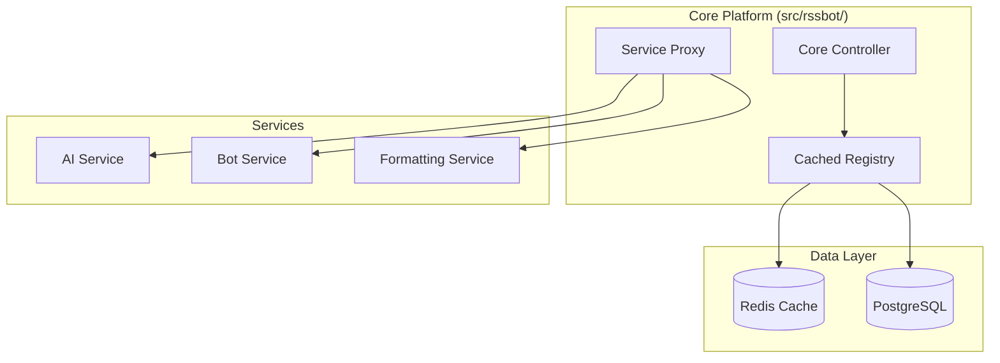

# 📚 RssBot Platform Wiki

Welcome to the comprehensive documentation for the **RssBot Hybrid Microservices Platform**.

## 🚀 Quick Navigation

### 🏁 Getting Started
- [**Getting Started Guide**](GETTING_STARTED) - Complete setup and installation
- [**Quick Start**](QUICK_START) - Get up and running in 5 minutes
- [**Configuration**](CONFIGURATION) - Environment and service configuration

### 🏗️ Architecture & Design
- [**Architecture Overview**](ARCHITECTURE) - Deep dive into the hybrid microservices design
- [**New Architecture Guide**](NEW_ARCHITECTURE) - Per-service connection methods
- [**Migration Guide**](ARCHITECTURE_MIGRATION_SUMMARY) - Migrating from legacy systems

### 👨‍💻 Development
- [**Development Guide**](DEVELOPMENT) - Contributing and development workflow
- [**API Reference**](API) - Complete API documentation
- [**Testing Guide**](TESTING) - Testing strategies and frameworks

### 🚀 Deployment & Operations
- [**Production Deployment**](PRODUCTION) - Production deployment and scaling
- [**Docker Guide**](DOCKER) - Container deployment strategies
- [**Monitoring**](MONITORING) - Health monitoring and performance metrics

### 🔒 Security & Compliance
- [**Security Policy**](../SECURITY) - Security best practices and vulnerability reporting
- [**Environment Security**](ENVIRONMENT_SECURITY) - Safe configuration management

### 📋 Project Information
- [**GitHub Ready Summary**](GITHUB_READY_SUMMARY) - Complete project transformation overview
- [**Contributing Guidelines**](../CONTRIBUTING) - How to contribute to the project
- [**License**](../LICENSE) - Apache 2.0 with attribution requirements

## 🌍 Language Support

### 🇺🇸 English Documentation
Complete technical documentation in English for developers and system administrators.

### 🇮🇷 Persian Documentation
- [**راهنمای شروع**](../fa/راهنمای-شروع) - راهنمای کامل نصب و راه‌اندازی
- [**معماری سیستم**](../fa/معماری-سیستم) - توضیح کامل معماری hybrid microservices

## 🎯 Platform Features

### Revolutionary Architecture
- **Per-Service Connection Decisions**: Each service independently chooses router/rest/hybrid/disabled
- **Redis-Cached Registry**: Sub-millisecond service discovery (1000x faster than database)
- **Zero-Downtime Configuration**: Live service reconfiguration without restarts
- **Self-Healing**: Automatic health monitoring and intelligent routing

### Enterprise Features
- **Type-Safe**: 100% type hints throughout the codebase
- **Comprehensive Testing**: Unit, integration, and E2E test coverage
- **Production Ready**: Docker, Kubernetes, monitoring, and scaling
- **Security First**: Enterprise-grade security and compliance

## 🚀 Quick Start Example

```bash
# 1. Clone and setup
git clone https://github.com/EvolveBeyond/RssBot.git
cd RssBot && rye sync

# 2. Configure environment
cp .env.example .env
# Edit .env with your settings

# 3. Start the platform
python -m rssbot

# 4. Configure services
curl -X POST http://localhost:8004/services/ai_svc/connection-method \
     -d '{"connection_method": "router"}'
```

## 📊 Architecture Overview



## 🤝 Community

- **GitHub Repository**: [EvolveBeyond/RssBot](https://github.com/EvolveBeyond/RssBot)
- **Issues**: Report bugs and request features
- **Discussions**: Ask questions and share ideas
- **Contributing**: Help improve the platform

---

**This wiki is the definitive source for RssBot Platform documentation. All information is kept up-to-date with the latest platform developments.**