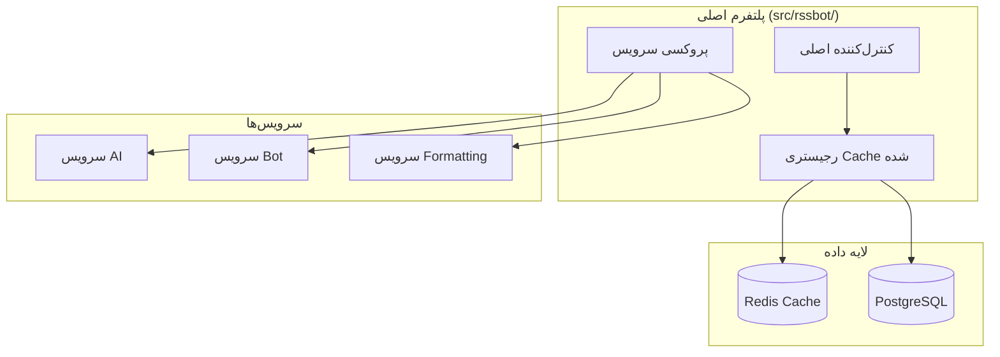

# 📚 ویکی پلتفرم RssBot

به مستندات جامع **پلتفرم Hybrid Microservices RssBot** خوش آمدید.

## 🚀 دسترسی سریع

### 🏁 شروع کار
- [**راهنمای شروع**](راهنمای-شروع) - نصب و راه‌اندازی کامل
- [**شروع سریع**](شروع-سریع) - اجرا در ۵ دقیقه
- [**پیکربندی**](پیکربندی) - تنظیمات محیط و سرویس‌ها

### 🏗️ معماری و طراحی
- [**بررسی معماری**](معماری-سیستم) - معماری hybrid microservices
- [**معماری جدید**](معماری-جدید) - تصمیم‌گیری per-service
- [**راهنمای مهاجرت**](راهنمای-مهاجرت) - انتقال از سیستم قدیمی

### 👨‍💻 توسعه
- [**راهنمای توسعه**](راهنمای-توسعه) - مشارکت و فرآیند development
- [**مرجع API**](مرجع-ای-پی-آی) - مستندات کامل API
- [**راهنمای تست**](راهنمای-تست) - استراتژی‌های تست

### 🚀 استقرار و عملیات
- [**استقرار Production**](استقرار-تولید) - استقرار و مقیاس‌پذیری
- [**راهنمای Docker**](راهنمای-داکر) - استراتژی‌های container deployment
- [**نظارت**](نظارت) - مانیتورینگ و متریک‌های عملکرد

### 🔒 امنیت و انطباق
- [**سیاست امنیت**](../SECURITY) - بهترین شیوه‌های امنیتی
- [**امنیت محیط**](امنیت-محیط) - مدیریت پیکربندی امن

## 🎯 ویژگی‌های پلتفرم

### معماری انقلابی
- **تصمیم‌گیری Per-Service**: هر سرویس مستقل انتخاب می‌کند router/rest/hybrid/disabled
- **Registry با Cache Redis**: کشف سرویس در زیر میلی‌ثانیه (۱۰۰۰ برابر سریع‌تر از database)
- **پیکربندی Zero-Downtime**: تنظیم زنده سرویس‌ها بدون restart
- **خودترمیم‌کننده**: نظارت خودکار سلامت و routing هوشمند

### ویژگی‌های Enterprise
- **Type-Safe**: ۱۰۰٪ type hints در تمام کد
- **تست جامع**: پوشش unit، integration و E2E
- **آماده Production**: Docker، Kubernetes، monitoring و scaling
- **امنیت اول**: امنیت سطح enterprise و انطباق

## 🚀 مثال شروع سریع

```bash
# ۱. Clone و setup
git clone https://github.com/EvolveBeyond/RssBot.git
cd RssBot && rye sync

# ۲. پیکربندی محیط
cp .env.example .env
# فایل .env را ویرایش کنید

# ۳. اجرای پلتفرم
python -m rssbot

# ۴. پیکربندی سرویس‌ها
curl -X POST http://localhost:8004/services/ai_svc/connection-method \
     -d '{"connection_method": "router"}'
```

## 📊 بررسی معماری



## 🌍 پشتیبانی زبان

### 🇺🇸 مستندات انگلیسی
[مستندات فنی کامل انگلیسی](../en/Home) برای توسعه‌دهندگان و مدیران سیستم.

### 🇮🇷 مستندات فارسی
مستندات کامل فارسی برای راه‌اندازی و استفاده از پلتفرم.

## 🤝 جامعه

- **مخزن GitHub**: [EvolveBeyond/RssBot](https://github.com/EvolveBeyond/RssBot)
- **Issues**: گزارش باگ و درخواست ویژگی
- **Discussions**: پرسش سؤال و اشتراک‌گذاری ایده‌ها
- **مشارکت**: کمک به بهبود پلتفرم

---

**این ویکی منبع قطعی برای مستندات پلتفرم RssBot است. تمام اطلاعات با آخرین تحولات پلتفرم به‌روز نگه داشته می‌شود.**